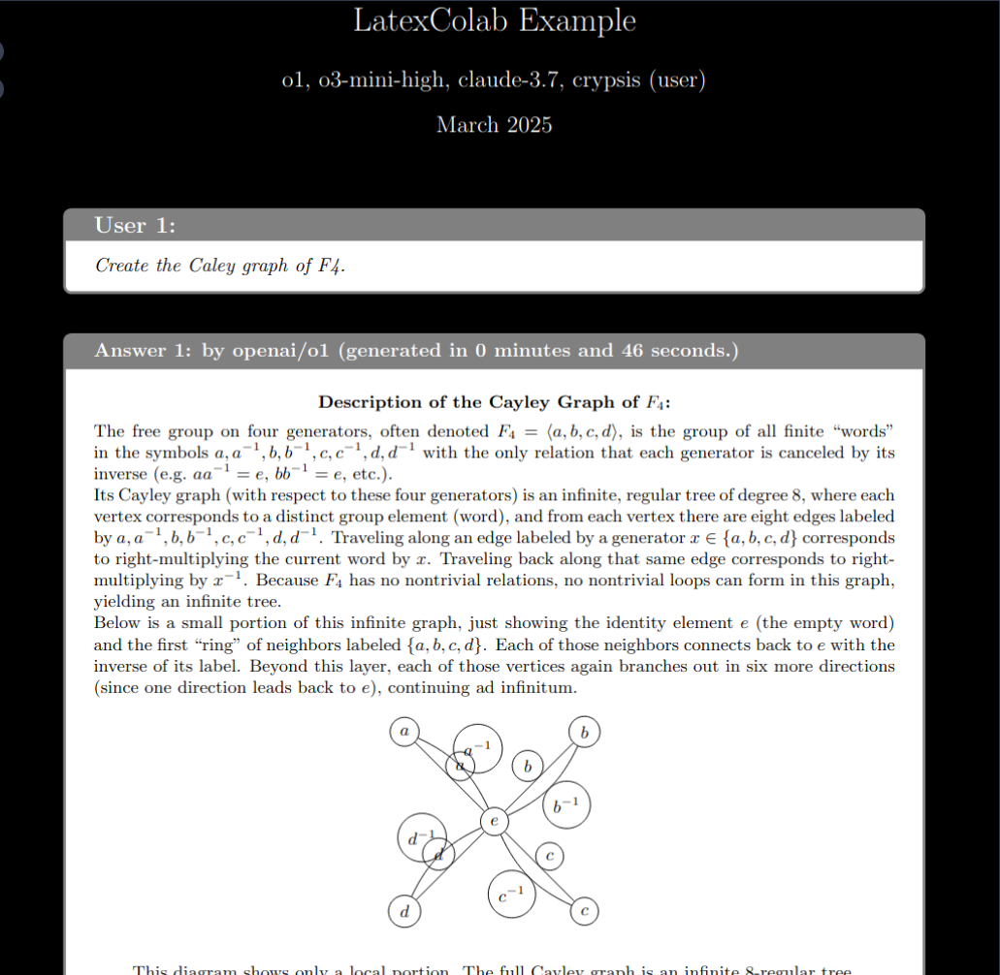
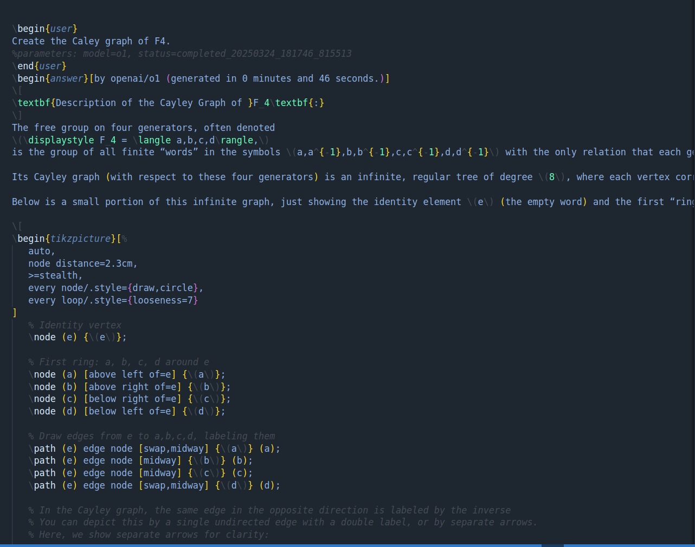
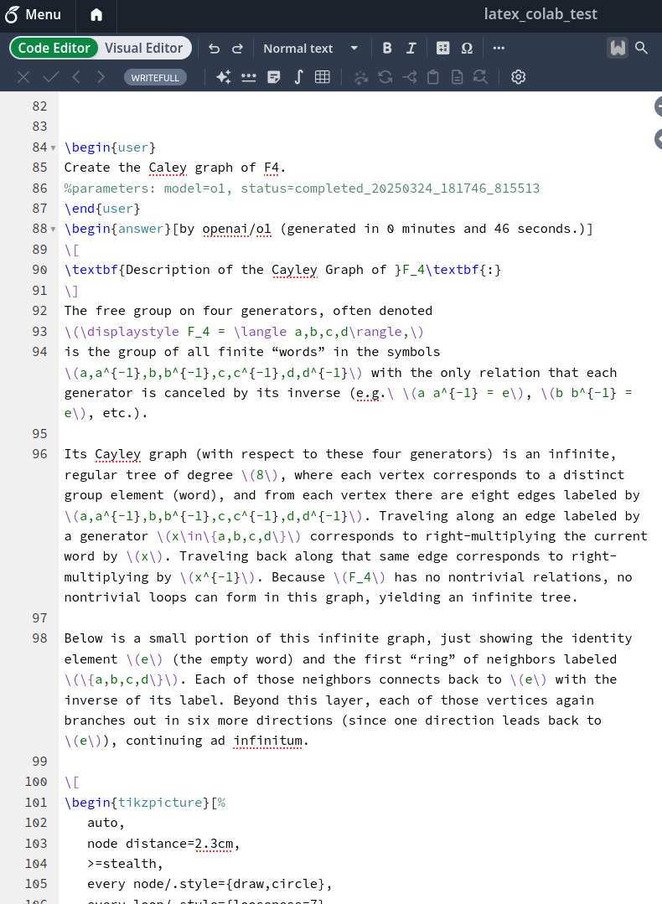

# LatexColab - Collaborative LaTeX Agent

<div align="left">
  
</div>

## Project Team

LatexColab is developed and maintained by:

- **A. Carmi**  - *Original Creator* - [acarmi](https://github.com/acarmi)
- **A. Kanevsky** - *Server Architecture Lead* - [arikanev](https://github.com/arikanev)

## Deployment Options

LatexColab offers two deployment methods to suit different needs:

1. **Local Script (Original Version)** - Self-contained local solution
2. **Server + Client Architecture** - For teams and advanced users

<div align="center">
  <table>
    <tr>
      <td align="center" width="33%">
        <a href="assets/sc1.png" target="_blank">
          
          <br>
          <em>Compiled main.pdf</em>
        </a>
      </td>
      <td align="center" width="33%">
        <a href="assets/sc2.png" target="_blank">
          
          <br>
          <em>Local main.tex</em>
        </a>
      </td>
      <td align="center" width="33%">
        <a href="assets/sc3.png" target="_blank">
          
          <br>
          <em>Overleaf main.tex</em>
        </a>
      </td>
    </tr>
  </table>
  <p><em>Click any image to view full size</em></p>
</div>

## Overview

LatexColab is a powerful tool that enables real-time collaboration with AI reasoning agents directly in your LaTeX documents. It maintains bidirectional synchronization between your local LaTeX files and Overleaf repositories, ensuring your work is always backed up and available.

## Features

- 🧠 **In-document AI collaboration**: Interact with AI models (Claude, GPT-4, etc.) directly from your LaTeX documents
- 🔄 **Bidirectional sync**: Changes made locally or on Overleaf are automatically synchronized
- 🛡️ **Fail-safe workflow**: Works with separate local and repository files to prevent data loss
- 📊 **Visual logging**: Monitor synchronization and agent activity through a clean interface
- 🧩 **Model flexibility**: Use any LLM supported by OpenRouter
- 🔍 **Reasoning transparency**: See both the reasoning process and final answer from AI models

## How It Works

LatexColab bridges the gap between your local LaTeX editor and Overleaf, while adding powerful AI assistance capabilities:

1. You maintain a local LaTeX file separate from the git repository
2. The agent monitors changes to your local file
3. When changes are detected, they are pushed to the Overleaf repository
4. When you engage the AI agent in your document, it responds directly in your LaTeX file
5. All changes are synchronized bidirectionally

## Deployment Options

### Option 1: Local Script (Original Version)

This is the simpler approach for individual users who want everything running on their local machine.

#### Prerequisites

- Python 3.7+
- Git
- LaTeX installation
- Overleaf account with API access

#### Installation

1. Clone this repository:
```bash
git clone https://github.com/yourusername/latexcolab.git
cd latexcolab
```

2. Install the required dependencies:
```bash
pip install -r requirements.txt
```

3. Set up your API keys in `set_api_keys.py`:
```bash
OPENROUTER_API_KEY = "your_openrouter_api_key"
OVERLEAF_GIT_API_TOKEN = "your_overleaf_git_api_token
```

#### Usage

The basic usage is simple:

```bash
./lc path/to/your/local_repo/local_file.tex  path/to/your/local_repo  overleaf_project_id
```

A recommended local repository structre is:

```bash
path/to/your/local_repo/
├── local_file.tex
└── overleaf_project_id/
    ├── .git/
    └── local_file.tex
```

For detailed instructions on obtaining Overleaf credentials, see [Overleaf_git_access.md](Overleaf_git_access.md).

To engage the AI agent, add a user environment to your LaTeX document:

```latex
\begin{user}
What is the significance of Euler's identity in mathematics?
%parameters: model=claude-3.7-sonnet, status=start
\end{user}
```

The agent will process your query and respond with:

```latex
\begin{reasoning}
[The agent's step-by-step reasoning process will appear here]
\end{reasoning}

\begin{answer}
[The agent's final, concise answer will appear here]
\end{answer}
```

### Option 2: Server + Client Architecture

This architecture (developed by [arikanev]) consists of two main parts:

1. **Server (`server.py`)**: Deployed (e.g., on Render), it synchronizes LaTeX content with Overleaf Git repositories and handles concurrent requests using Redis for locking.
2. **Local Client (`local_client.py`)**: Run by the user locally to process AI prompts and communicate with the server.

#### Deploying the Server

Follow these general steps (e.g., for Render):

- Push the code to a Git repository (GitHub, etc.)
- Create a Redis instance (`Key Value` store) on Render and get its Internal URL
- Create a Web Service on Render connected to your Git repo
- **Runtime**: Python 3
- **Build Command**: `pip install -r requirements.txt`
- **Start Command**: `uvicorn server:app --host 0.0.0.0 --port $PORT`
- **Environment Variable**: Set `REDIS_URL` to the Internal URL of your Render Redis instance
- Deploy the service and note its public URL

#### Running the Local Client

Prerequisites (Local Machine):
- Python 3.7+
- Install required Python packages: `pip install requests openai`
- Your OpenRouter API Key
- Your Overleaf Project's Git URL
- An Overleaf Git Token/Password
- The URL of your deployed LatexColab server

Run the client script:

```bash
python3 local_client.py path/to/your/local_file.tex \
    --key YOUR_OPENROUTER_API_KEY \
    --server YOUR_DEPLOYED_SERVER_URL \
    --git-url https://git.overleaf.com/YOUR_PROJECT_ID \
    --git-token YOUR_OVERLEAF_GIT_TOKEN \
    --relative-path path/within/overleaf/project/file.tex
```

## Latex Template Examples

See [LatexProjects/template.tex](LatexProjects/template.tex), and the example project [LatexProjects/Example](LatexProjects/Example/).

## Supported Models

Any model available through OpenRouter can be used, including:

- `claude-3.7-sonnet` - Anthropic's Claude 
- `o1`, `o3-mini-high`  - OpenAI
- `deepseek-r1`


## Troubleshooting

### Git Issues

If you encounter git synchronization problems:
- Ensure your Overleaf API token is correct
- Check if you have write permissions to the repository
- Verify your network connection

### Agent Not Responding

If the agent isn't responding to your queries:
- Make sure you included `status=start` in your parameters
- Check that your OpenRouter API key is valid
- Verify the model name is correct

## License

## Acknowledgments

- The Anthropic Claude team for their advanced LLM capabilities
- The Overleaf team for their excellent LaTeX collaboration platform

## Related Projects

- [LatexColabHosted](https://github.com/arikanev/LatexColabHosted) - The server-based version by [Ariel Kanevsky]